# Code Reference

This document is a source-oriented walkthrough of the two Python modules in the repository.

## `cifar10_pt_fl.py`

### Responsibilities

This module owns:

- the CNN architecture
- data loading and preprocessing
- local training
- local evaluation
- communication with the NVFlare client runtime

### Model definition: `Net`

`Net` is a small CNN with two convolutional blocks followed by three fully connected layers.

### Layer layout

| Stage | Definition | Output shape from `3 x 32 x 32` input |
| --- | --- | --- |
| Input | CIFAR-10 RGB image | `3 x 32 x 32` |
| Conv 1 | `Conv2d(3, 6, 5)` | `6 x 28 x 28` |
| Pool 1 | `MaxPool2d(2, 2)` | `6 x 14 x 14` |
| Conv 2 | `Conv2d(6, 16, 5)` | `16 x 10 x 10` |
| Pool 2 | `MaxPool2d(2, 2)` | `16 x 5 x 5` |
| Flatten | `torch.flatten(x, 1)` | `400` |
| FC 1 | `Linear(16 * 5 * 5, 120)` | `120` |
| FC 2 | `Linear(120, 84)` | `84` |
| FC 3 | `Linear(84, 10)` | `10 logits` |

### Model diagram

```mermaid
flowchart LR
    I["Input image\n3 x 32 x 32"] --> C1["Conv2d\n3 -> 6, k=5"]
    C1 --> R1["ReLU"]
    R1 --> P1["MaxPool2d\n2 x 2"]
    P1 --> C2["Conv2d\n6 -> 16, k=5"]
    C2 --> R2["ReLU"]
    R2 --> P2["MaxPool2d\n2 x 2"]
    P2 --> F["Flatten\n16 x 5 x 5 = 400"]
    F --> FC1["Linear\n400 -> 120"]
    FC1 --> R3["ReLU"]
    R3 --> FC2["Linear\n120 -> 84"]
    FC2 --> R4["ReLU"]
    R4 --> FC3["Linear\n84 -> 10"]
    FC3 --> O["Class logits"]
```



### Module-level configuration

| Constant | Value | Meaning |
| --- | --- | --- |
| `DATASET_PATH` | `/tmp/nvflare/data` | Shared local directory for CIFAR-10 downloads. |
| `DEVICE` | `"cuda"` if available, else `"cpu"` | Training and evaluation device. |
| `BATCH_SIZE` | `4` | Batch size for both train and test loaders. |
| `EPOCHS` | `2` | Local epochs per federated round. |
| `MODEL_PATH` | `./cifar_net.pth` | Per-round local checkpoint path. |

### Data pipeline

The transform pipeline is:

```python
transforms.Compose(
    [
        transforms.ToTensor(),
        transforms.Normalize((0.5, 0.5, 0.5), (0.5, 0.5, 0.5)),
    ]
)
```

Both train and test splits use the same normalization. The train loader shuffles data; the test loader does not.

### Federated control flow

The key NVFlare integration points are:

| API | Purpose |
| --- | --- |
| `flare.init()` | Initializes the client runtime. |
| `flare.is_running()` | Controls the lifecycle of the round-processing loop. |
| `flare.receive()` | Receives an `FLModel` from NVFlare. |
| `flare.FLModel(...)` | Wraps outgoing parameters, metrics, and metadata. |
| `flare.send(output_model)` | Sends local results back to NVFlare. |

### Training behavior

For each received model:

1. the received parameters are loaded into `net`
2. a new loss object and optimizer are created
3. the model is trained locally for two epochs
4. progress is printed every 2000 mini-batches
5. a checkpoint is saved to disk

### Optimizer settings

| Setting | Value |
| --- | --- |
| Optimizer | SGD |
| Learning rate | `0.001` |
| Momentum | `0.9` |
| Scheduler | None |

### Evaluation behavior

The module defines an inner helper:

```python
def evaluate(input_weights):
    ...
```

It:

- instantiates a fresh `Net`
- loads the provided weights
- runs inference on the test loader
- returns integer percentage accuracy using floor division

That last point is subtle. The returned metric is computed as:

```python
100 * correct // total
```

So the result is an integer percentage rather than a floating-point accuracy.

### Metrics and metadata returned to NVFlare

The outgoing `FLModel` contains:

| Field | Source |
| --- | --- |
| `params` | `net.cpu().state_dict()` after local training |
| `metrics["accuracy"]` | result of `evaluate(input_model.params)` |
| `meta["NUM_STEPS_CURRENT_ROUND"]` | `EPOCHS * len(trainloader)` |

### Important semantic note

The reported `accuracy` is based on the incoming model parameters, not the trained local parameters. If you later compare server-side metrics to local training progress, this difference will matter.

## `job.py`

### Responsibilities

This module owns the federated job assembly, not the local ML logic.

### Job configuration

| Constant | Value | Meaning |
| --- | --- | --- |
| `N_CLIENTS` | `2` | Number of sites required by the FedAvg controller. |
| `NUM_ROUNDS` | `2` | Number of federated aggregation rounds. |
| `TRAIN_SCRIPT` | `cifar10_pt_fl.py` | Script executed on each client site. |

### Job assembly steps

The script performs four main tasks:

1. creates `BaseFedJob(name="cifar10_pt_fedavg", initial_model=Net())`
2. creates `FedAvg(num_clients=N_CLIENTS, num_rounds=NUM_ROUNDS)`
3. registers a `ScriptRunner` for each site name `site-0`, `site-1`
4. exports the job definition

### Control-plane versus data-plane split

It is useful to think of the repository in two halves:

- `job.py`: control-plane configuration
- `cifar10_pt_fl.py`: data-plane client execution

That split is what keeps the example small and readable.

### What is not present

The codebase intentionally omits:

- configurable CLI arguments
- environment-driven configuration
- automated tests
- model checkpoint rotation
- explicit train/validation split separation
- production observability or structured logging

Those omissions are normal for an educational baseline, but they are the first places most teams would extend.
