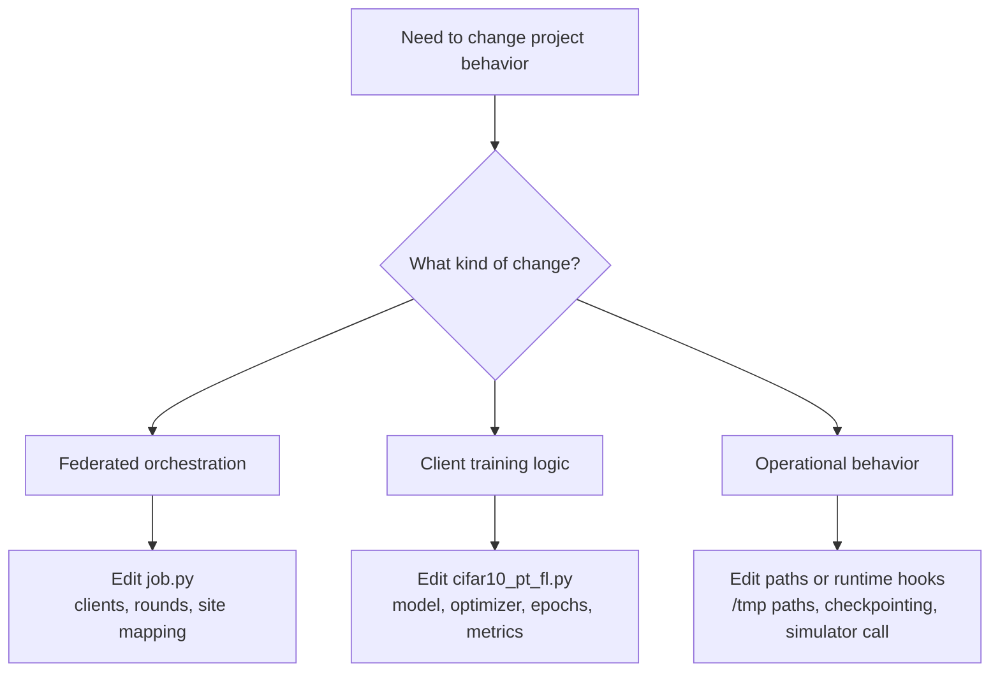

# Development Guide

This guide explains how to evolve the project without having to rediscover where each concern lives.

## Where To Change What

| Goal | Primary file |
| --- | --- |
| Change the number of clients | `job.py` |
| Change the number of federated rounds | `job.py` |
| Change the site script executed by each client | `job.py` |
| Change the model architecture | `cifar10_pt_fl.py` |
| Change the optimizer, epochs, or batch size | `cifar10_pt_fl.py` |
| Change the dataset path or transforms | `cifar10_pt_fl.py` |
| Change the metrics sent back to NVFlare | `cifar10_pt_fl.py` |

## Common Modification Paths

## Recommended Areas To Improve First

If this repository is meant to grow beyond a demo, the highest-leverage improvements are:

1. make runtime configuration explicit
2. separate standalone training concerns from NVFlare client concerns
3. tighten metric semantics
4. add basic tests around model construction and configuration wiring

### 1. Make runtime configuration explicit

Most operational settings are hard-coded today:

- dataset path
- batch size
- epochs
- number of rounds
- number of clients
- model checkpoint path

The cleanest next step is to move these into a configuration layer so the same code can be reused across experiments.

### 2. Clarify supported execution modes

The repository currently mixes two ideas in its historical documentation:

- exporting or running an NVFlare job
- running the training script directly

From the code, the supported path is clearly the NVFlare client path because the script depends on `nvflare.client`. If direct local training is a real requirement, the code should expose a separate standalone entrypoint rather than reusing the same function.

### 3. Revisit metric semantics

Two implementation details are worth deciding intentionally:

- whether accuracy should evaluate the incoming model or the post-training local model
- whether logged loss should represent the summed loss window or the averaged loss window

Neither choice is inherently wrong, but both should be explicit because downstream monitoring depends on them.

### 4. Add a minimal test layer

There is no test suite in the current repository. A practical starting point would be:

- model construction test for `Net`
- shape-forward test using a synthetic CIFAR-sized tensor
- smoke test that `job.py` builds the expected number of sites and rounds

## Operational Notes

### Local storage and artifacts

The project writes to `/tmp`, which is convenient for a demo but easy to lose:

| Path | Risk |
| --- | --- |
| `/tmp/nvflare/data` | Dataset may need to be re-downloaded after cleanup. |
| `/tmp/nvflare/jobs/job_config` | Exported job packages are not durable by default. |
| `./cifar_net.pth` | Rewritten locally during training rounds. |

### GPU behavior

GPU use is split across the two modules:

- `cifar10_pt_fl.py` auto-detects CUDA and uses it if present
- `job.py` includes a commented simulator invocation showing `gpu="0"`

If you re-enable simulator execution in `job.py`, make sure the GPU assumption still matches the machine that will run it.

### Troubleshooting Checklist

| Symptom | Likely place to inspect |
| --- | --- |
| Job exports but nothing trains | `job.py`, because the simulator call is currently disabled. |
| Dataset download issues | `cifar10_pt_fl.py` and permissions under `/tmp/nvflare/data`. |
| Metrics look stale or unexpectedly low | `cifar10_pt_fl.py` evaluation path, because it scores the received model. |
| No checkpoint appears | current working directory for `MODEL_PATH` and whether the client loop reached post-training code. |
| CUDA is not used | local PyTorch CUDA availability and `DEVICE` resolution in `cifar10_pt_fl.py`. |

### Suggested Next Documentation Additions

If the codebase grows, the next useful docs would be:

1. an experiment configuration guide
2. a troubleshooting guide with real failure modes from local runs
3. a testing guide once `pytest` coverage exists
