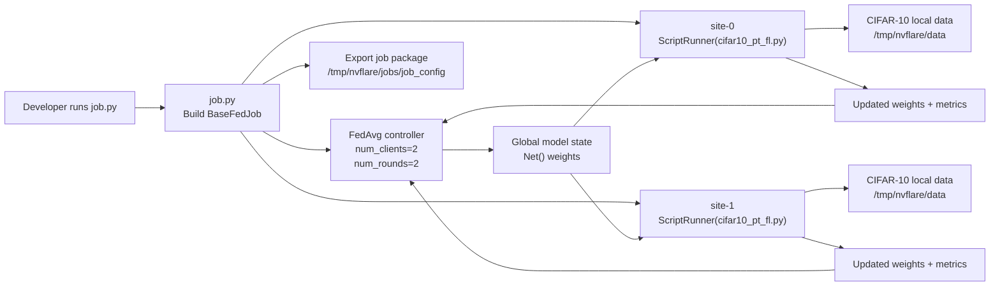

# Project Overview

## Purpose

This project demonstrates a minimal federated learning workflow using:

- NVFlare for orchestration
- PyTorch for model definition and optimization
- torchvision for CIFAR-10 data loading and preprocessing

At a high level, `job.py` defines a federated averaging job, and `cifar10_pt_fl.py` implements the work each client site performs when NVFlare dispatches a round.

## What This Repository Contains

| File | Role |
| --- | --- |
| `job.py` | Builds an NVFlare `BaseFedJob`, configures `FedAvg`, assigns the training script to each site, and exports the job package. |
| `cifar10_pt_fl.py` | Defines the CNN (`Net`), loads CIFAR-10, receives weights from NVFlare, performs local training, evaluates a model, and sends updated weights back. |
| `requirements.txt` | Pins all Python dependencies required by the example, including NVFlare, PyTorch, and CUDA-enabled torch packages. |

## Current Behavior Summary

| Concern | Current value or behavior |
| --- | --- |
| Number of clients | `2` |
| Number of FL rounds | `2` |
| Local epochs per round | `2` |
| Batch size | `4` |
| Aggregation workflow | FedAvg |
| Dataset | CIFAR-10 |
| Dataset root | `/tmp/nvflare/data` |
| Exported job path | `/tmp/nvflare/jobs/job_config` |
| Simulator launch from `job.py` | Disabled in the current revision because `job.simulator_run(...)` is commented out |

## High-Level Architecture

## Runtime Artifacts

| Path | Produced by | Purpose |
| --- | --- | --- |
| `/tmp/nvflare/jobs/job_config` | `job.py` | Exported NVFlare job package. |
| `/tmp/nvflare/data` | `cifar10_pt_fl.py` | Download target for CIFAR-10 train and test splits. |
| `./cifar_net.pth` | `cifar10_pt_fl.py` | Local checkpoint written after each training round. |

## Observations About the Current Implementation

### 1. `job.py` is currently an export script

The script constructs the job and writes it to disk, but it does not launch the simulator because the relevant line is commented out.

### 2. The client script is tightly coupled to NVFlare runtime

The main loop calls:

- `flare.init()`
- `flare.is_running()`
- `flare.receive()`
- `flare.send(...)`

That means the script is designed to execute inside NVFlare's client lifecycle, not as a plain standalone PyTorch training program.

### 3. This is a deliberately small baseline

The model is a classic two-convolution CNN, the configuration is hard-coded at module level, and there is no dedicated test suite or packaging layer. That makes the repository easy to understand, but it also means most production concerns would need to be added explicitly.

## Recommended Reading Order

1. Read [Runtime Flow](runtime-flow.md) to understand how one federated round moves through the system.
2. Read [Code Reference](code-reference.md) for a module-by-module explanation of the implementation.
3. Read [Development Guide](development-guide.md) before changing configuration, metrics, or model structure.
