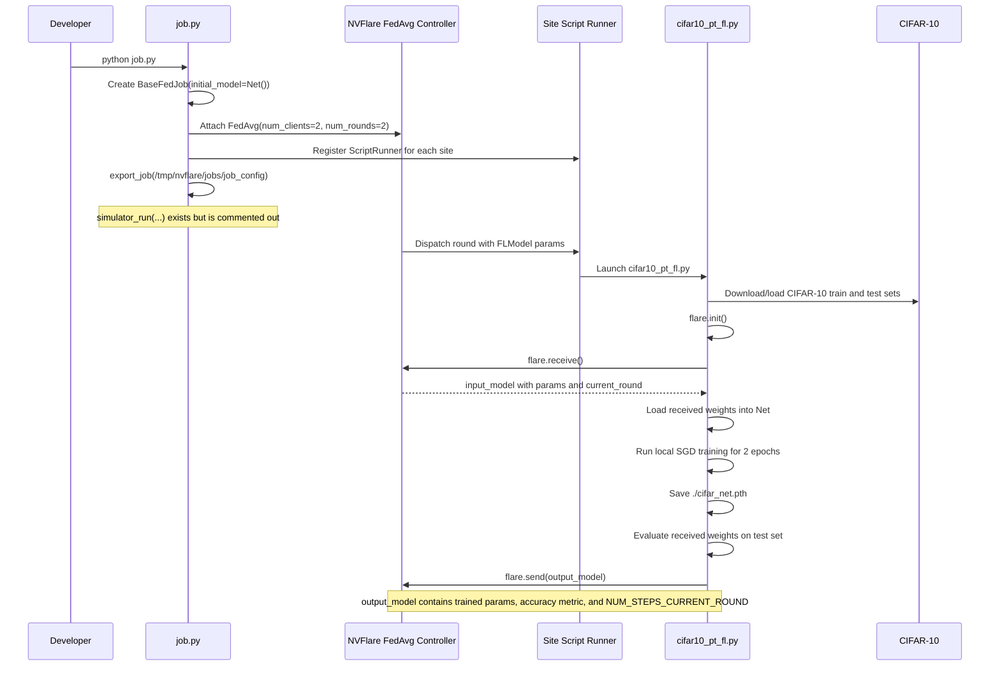
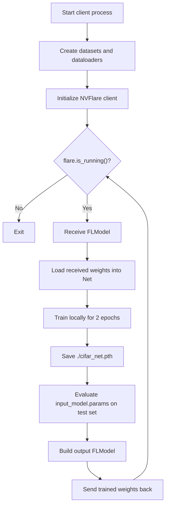

# Runtime Flow

This document describes what happens from the moment a developer runs `job.py` to the moment a client sends an updated model back to NVFlare.

## End-to-End Lifecycle



## Detailed Execution Steps

### 1. Job definition in `job.py`

When `job.py` runs, it:

1. creates a `BaseFedJob` named `cifar10_pt_fedavg`
2. uses `Net()` as the initial model
3. configures a `FedAvg` controller with:
   - `num_clients = 2`
   - `num_rounds = 2`
4. attaches one `ScriptRunner(script="cifar10_pt_fl.py")` to each site
5. exports the job package to `/tmp/nvflare/jobs/job_config`

The simulator call is present but disabled:

```python
# job.simulator_run("/tmp/nvflare/jobs/workdir", gpu="0")
```

So the current runtime path ends at exported job generation unless that line is re-enabled or the exported job is run through another NVFlare entrypoint.

### 2. Client bootstrapping in `cifar10_pt_fl.py`

Each site script:

1. builds the CIFAR-10 transform pipeline
2. downloads or reuses the train split
3. downloads or reuses the test split
4. instantiates `Net()`
5. initializes NVFlare via `flare.init()`
6. enters a `while flare.is_running():` loop

The data loaders are created before the federated loop begins, so the dataset setup happens once per process rather than once per round.

### 3. Round handling inside the client loop

For every round, the client:

1. receives an `input_model` from NVFlare
2. prints the current round number
3. loads `input_model.params` into the local `Net`
4. builds a fresh `CrossEntropyLoss`
5. builds a fresh SGD optimizer with:
   - learning rate `0.001`
   - momentum `0.9`
6. moves the model to the detected device
7. trains for `EPOCHS = 2`

### 4. Local training semantics

The local training loop uses:

- batch size `4`
- shuffling enabled on the train loader
- `num_workers = 2`
- `CrossEntropyLoss`
- SGD without any scheduler

It also computes:

```text
steps = EPOCHS * len(trainloader)
```

This value is later sent to NVFlare in:

```python
meta={"NUM_STEPS_CURRENT_ROUND": steps}
```

### 5. Logging behavior

Every 2000 mini-batches, the script:

- prints the average loss over the last 2000 mini-batches
- logs a scalar to NVFlare's `SummaryWriter`

One implementation detail matters here: the logged scalar is `running_loss`, which is the accumulated loss sum across the window, while the printed value is `running_loss / 2000`.

### 6. Checkpointing and evaluation

After local training completes, the client:

1. saves the trained state dict to `./cifar_net.pth`
2. defines an `evaluate(input_weights)` helper
3. evaluates `input_model.params`
4. constructs an `FLModel` using:
   - `params=net.cpu().state_dict()` for the trained local weights
   - `metrics={"accuracy": accuracy}` from the evaluation result
   - `meta={"NUM_STEPS_CURRENT_ROUND": steps}`

This means the metric and the returned parameters come from different model states:

- returned parameters: locally trained model after the round
- reported accuracy metric: model passed into `evaluate`, which is currently the received round input

That distinction is important if you intend to treat the reported metric as post-training local validation.

## Round State Diagram



## Practical Takeaways

- `job.py` is currently safe to think of as a job exporter, not a simulator runner.
- `cifar10_pt_fl.py` is the true client workload and contains almost all of the learning logic.
- The client process owns data loading, local optimization, local checkpointing, and local evaluation.
- If you change client training behavior, nearly all of that work will happen in `cifar10_pt_fl.py`.
